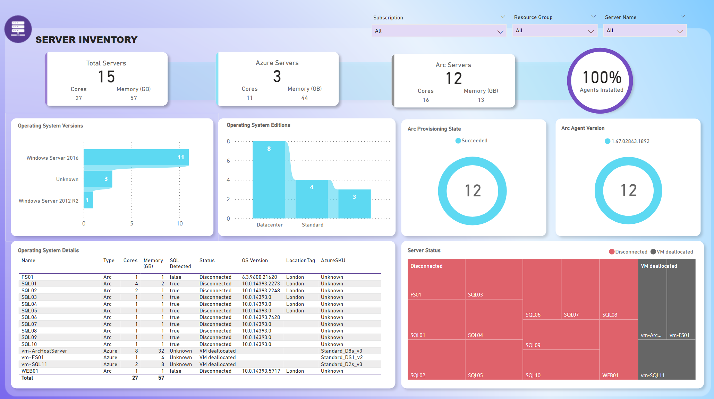
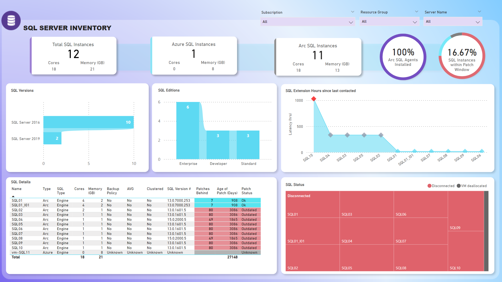
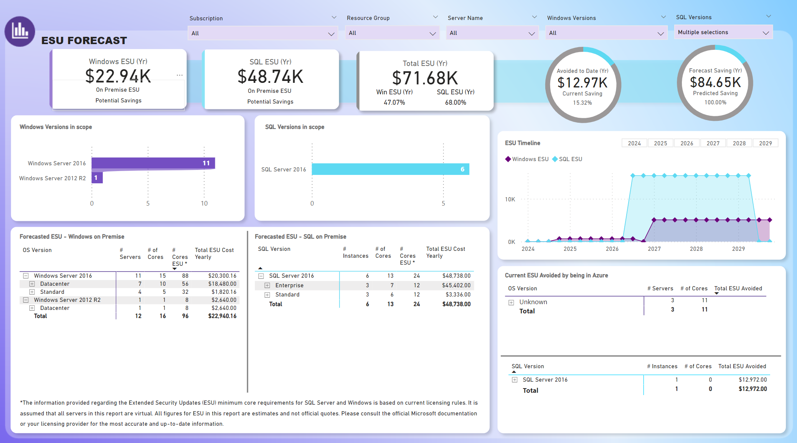

# Arc and Azure Sample Dashboard
This is a sample Arc dahsboard used to demonstrate the insights availible via Arc and Azure Resource Graph for your IT infrastructure. The dashboard covers a wide range of components including servers, SQL Instances, SQL Databases and ESU (Extended Security Updates) forecasting for servers connected to Arc or in Azure.

## Disclaimer
This Sample Report is provided "as is" without warranty of any kind, either express or implied, including but not limited to the implied warranties of merchantability and fitness for a particular purpose. Microsoft does not warrant that the script/functionality will meet your requirements or that the operation of the script/functionality will be uninterrupted or error-free. Use of the Sample Report is at your own risk. Microsoft will not be liable for any damages arising from the use of this script/functionality.

All figures for ESU in this report are estimates and not official quotes. Please consult the official Microsoft documentation or your licensing provider for the most accurate and up-to-date information.

## Screenshots
Here are some screenshots of the Arc Dashboard:

  
  

  
  

# What is Included in the ArcDashboard
The dashboard has 4 sections
1. Server Inventory - WIll include Arc and Azure Servers
2. SQL Inventory - Will include Arc and Azure SQL Servers
3. Databases - Will include Arc Databases only
4. ESU Forecast - Provides an estimate, based on todays pricing, ESU future Costs for WIndows 2016 and SQL 2016 Extended Support Updates. For detailed prices of ESUs see: https://azure.microsoft.com/en-us/pricing/details/azure-arc/core-control-plane/

## Data Sources Used
The Dashboard has the following data sources:
1. Resource Graph - Used to gather Servers, SQL Instances and Databases across Azure and Connected to Azure Arc. Credentials will be required with Read Access to Resource Graph to your Azure Subscriptions
2. Learn.microsoft.com - Used to gather latest SQL Patch information
3. Dimentions Folder - CSVs containing Azure SKUs and Product Lifecycle dates

## How to Install
1. Download the Power BI Template file: ArcDashboard-Final.pbit
2. Open PBI Template File, upon first opening the PBI will refresh
3. PBI will prompt for credentials for "Azure Resource Graph"
   

5. Sign into your with a login that has read Access to Resource Graph for the subscription(s) you want the report to view.
6. Click "Connect" each time you are prompted
7. Ignore any errors (see known Issues)
8. Save your new PBI Dashboard

## Known Issues
1. If there are no resources (Servers, SQL Instances, Databases) in your susbscription the Report may encounter Errors.

